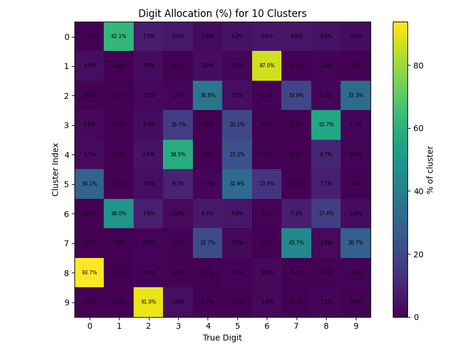
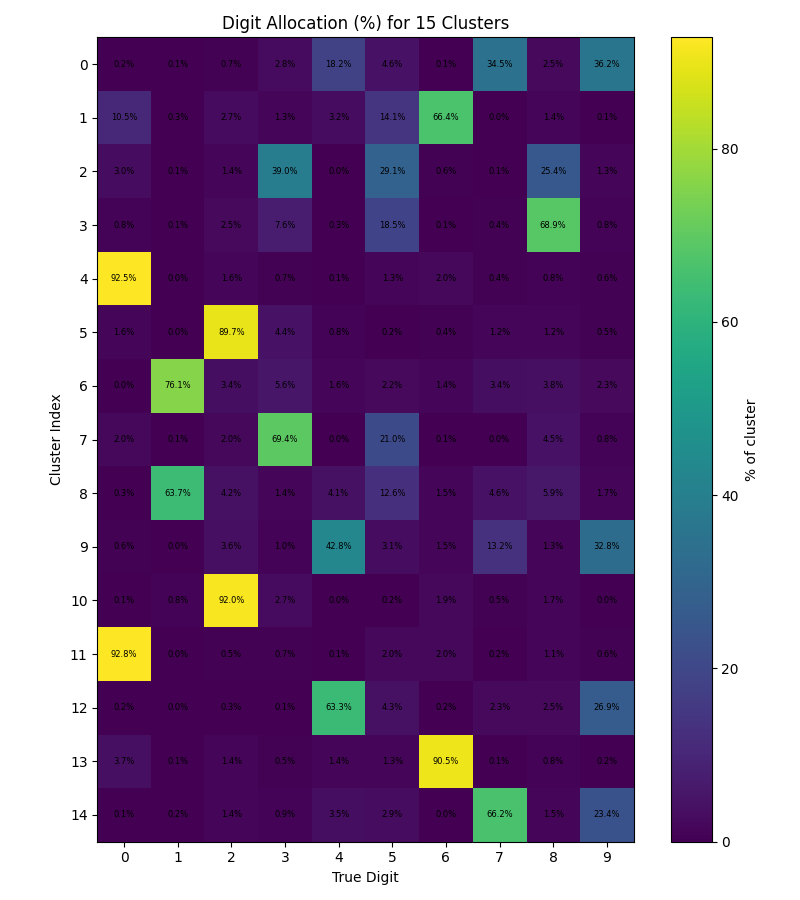
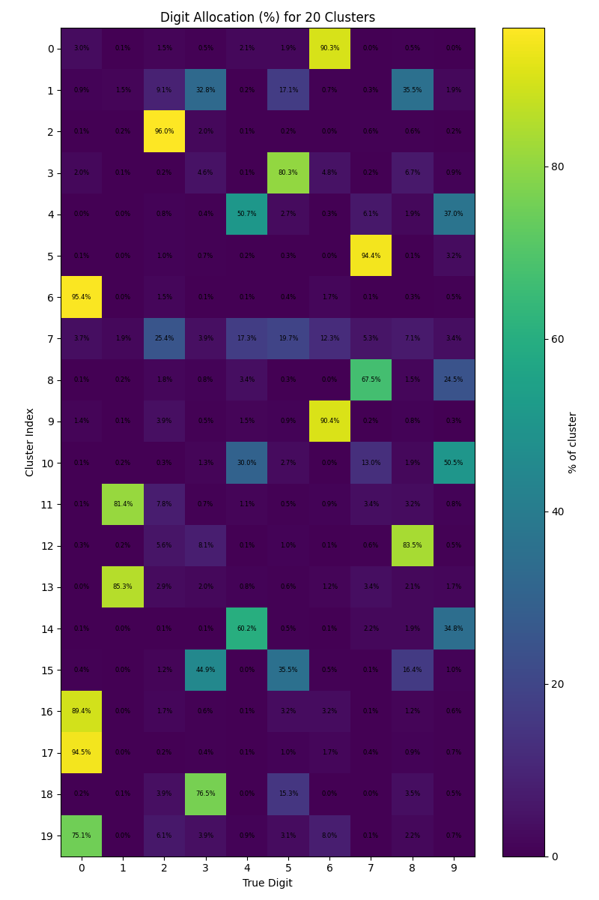
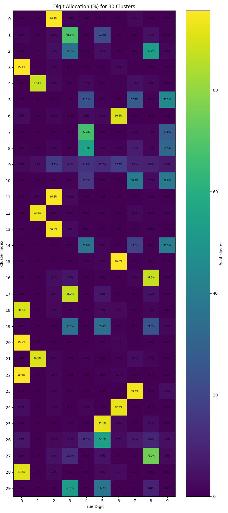
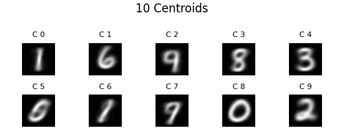
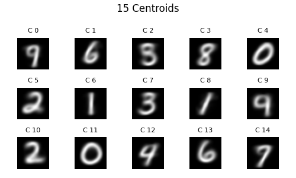
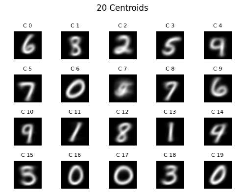
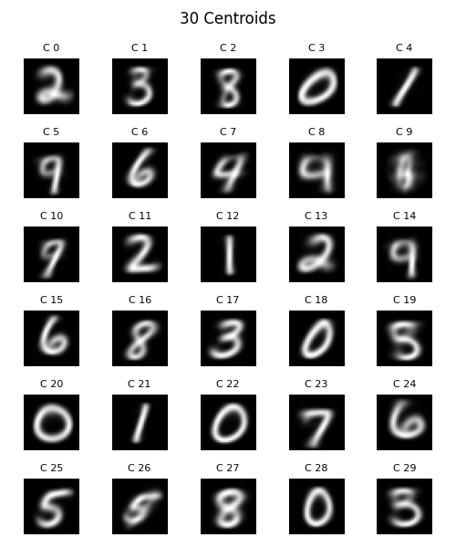

# Sprawozdanie z klasteryzacji zbioru MNIST przy użyciu k-means++

---

## 1. Cel i Metodologia

- **Cel:** Podzielenie danych ze zbioru MNIST na k klastrów i ocenienie 
poprawnej klasyfikacji klastrów względem rzeczywistych etykiet cyfr.
- **Metodologia:** Algorytm mini-batch k-means z inicjalizacją k-means++.
- **Algorytm:**  
  1. **Inicjalizacja k-means++**  
     - Pierwszy centroid losowany.  
     - Kolejne centroidy dobierane losowo z prawdopodobieństwem proporcjonalnym do kwadratu odległości od najbliższego istniejącego centroidu.  
  2. **Mini-batch updates**  
     - Próbka \(B=256\) obrazów na iterację.  
     - Przydział każdego obrazu do najbliższego centroidu + aktualizacja centroidu przez średnią ważoną.  
  3. **Kilka pomiarów**  
     - Dla każdego k wykonano $n_{runs}$ niezależnych inicjalizacji, wybrano te o najniższej inercji.

---

## 2. Wyniki dla różnych \(k\)

W tabeli poniżej zestawiono uzyskane minimalne wartości inercji:

| k  | Najlepsza inercja |
|:--:|:-----------------:|
| 10 | 2752630.25   |
| 15 | 2581922.25  |
| 20 | 2475737.25 |
| 30 |  2336498.75   |

---

## 2.1 Macierze alokacji procentowej

Dla każdego k narysowano macierze, w której wiersze to indeksy klastrów, kolumny to prawdziwe cyfry 0–9, a wartość w komórce to procentowa ilość danej cyfry w klastrze.

### 10 Klastrów
Klastry 1, 8 i 9 dobrze sklasyfikowały odpowiednio cyfry 6, 0 i 2. Przy
reszcie cyfr występuje większe rozproszenie między klastrami. Szczególnie
cyfry 4, 5, 7 i 9 mają słabą rozpoznawalność.

### 15 Klastrów
Mamy tutaj klastry klasyfikujące nienajgorzej cyfry 0, 1, 2 i 6.
Reszta cyfr jest mylona z innymi.

### 20 Klastrów
Istnieją klastry poprawnie klasyfikujące cyfry 0, 1, 2, 3, 5, 6, 7 i 8.
Jedynie 4 i 9 nie znalazły swojego odwzorowania.

### 30 Klastrów
Istnieją klastry poprawnie klasyfikujące cyfry 0, 1, 2, 3, 5, 6, 7 i 8,
a więc podobnie jak przy dwudziestu klastrach.

### Wniosek
Z macierzy wynika, że optymalną liczbą klastrów jest 20, ponieważ sklasyfikowała
aż 8 cyfr poprawnie.

---

## 2.2 Obrazy centroidów

Większość centroidów odwzorowuje charakterystyczny kształt odpowiadającej im cyfry, choć bywają rozmyte i czasami zawierają cechy pobliskich klas — szczególnie gdy klaster jest mniej „czysty”.

Jest to swego rodzaju wizualizacja macierzy przedstawionych w poprzednim
punkcie.

### 10 Klastrów

### 15 Klastrów

### 20 Klastrów

### 30 Klastrów

