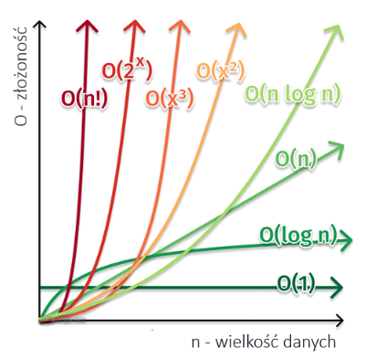
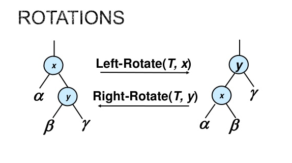
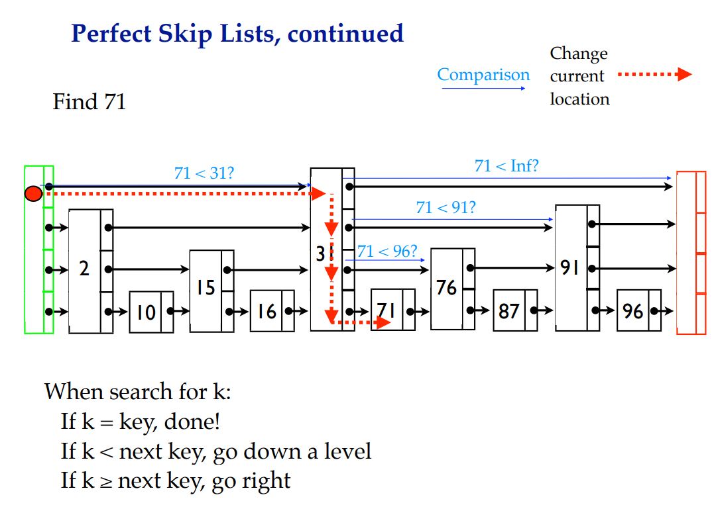
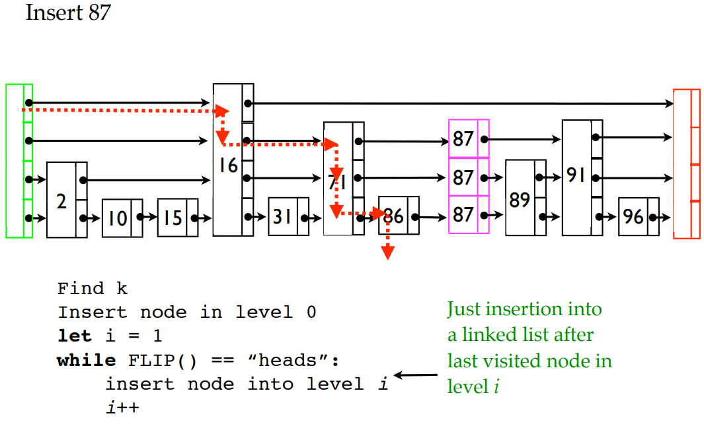
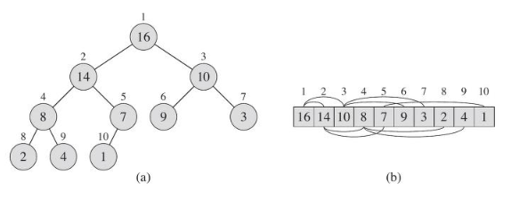
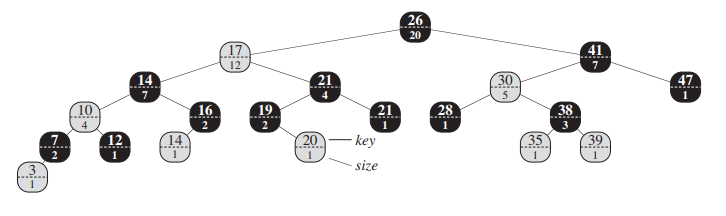
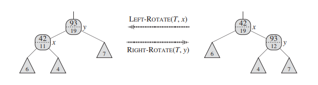
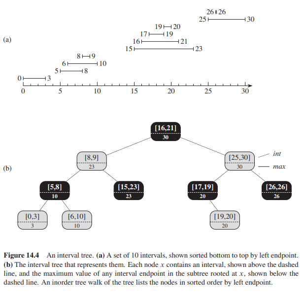
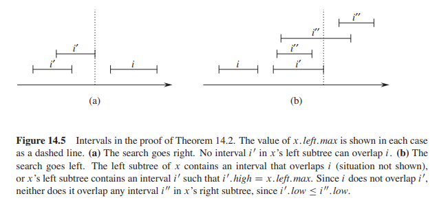

# Notatki z AiDS

## Notacja asymptotyczna

### Θ-duże

Notacji Θ używamy do **ograniczenia** asymptotycznego tempa wzrostu czasu wykonania
algorytmu **od góry i od dołu** za pomocą dwóch stałych współczynników. 
Zatem jeśli $f(n) = Θ(g(n))$ to od wystarczająco dużego n
czas wykonania musi być
ograniczony od góry i od dołu przez
$𝑐_1*g(n)$ oraz $𝑐_2*g(n)$.

$f(n) = Θ(g(n))$ wtedy i tylko wtedy jeśli $f(n) = O(g(n))$ i $g(n) = O(f(n))$.

### O-duże

Jeżeli chcemy **ograniczyć** czas wykonania tylko **od góry** to używamy notacji "duże O".
Jeśli $f(n)=O(g(n))$ to istnieje c, że od wystarczająco dużego n spełnione jest $|f(n)| <= c*|g(n)|$

np. $2n^2=O(n^3)$ i $2n^2=O(n^2)$

### Ω-duże

Jeżeli chcemy powiedzieć, że algorytm zajmuje przynajmniej pewną ilość czasu bez podawania
górnej granicy używamy notacji duże-Ω. $f(n)=Ω(g(n))$ wtedy i tylko wtedy jeśli
istnieje c, że od wystarczająco dużego n spełnione jest $c*|g(n)| <= |f(n)|$.

np. $n^3=Ω(2n^2)$

### o-małe

Funkcja f (n) jest **niższego rzędu** niż g(n), czyli ma złożoność
o(g(n)), jesli:
$∀𝑐 > 0$ $ ∃𝑛_0 > 0 $ $ ∀𝑛 > 𝑛_0 $ $ 𝟎 ≤ 𝒇(𝒏) < 𝒄*𝒈(𝒏)$
Na przykład $3𝑛^2 = 𝑜(𝑛^3)$ 𝑎𝑙𝑒 $3𝑛^2 ≠ 𝑜(𝑛^2)$

### ω-małe

Funkcja f(n) jest **wyższego rzędu** niż g(n), czyli ma złożoność ω(g(n)), jeśli:
$∀𝑐 > 0$ $∃𝑛_0 > 0$ $∀𝑛 > 𝑛_0$ $𝟎 ≤ 𝒄*𝒈(𝒏) < 𝒇(𝒏)$
Na przykład $𝑛 + 5 = ω(log 𝑛)$ 𝑎𝑙𝑒 $3𝑛^2 ≠ 𝜔(𝑛^2)$



## Drzewo Czerwono-Czarne RBT

- Każdy węzeł drzewa jest albo czerwony, albo czarny.
- Każdy liść drzewa (węzeł pusty nil) jest zawsze czarny.
- Korzeń drzewa jest zawsze czarny.
- Jeśli węzeł jest czerwony, to obaj jego synowie są czarni – innymi słowy, w drzewie nie mogą występować dwa kolejne czerwone węzły, ojciec i syn.
- **Każda prosta ścieżka** od danego węzła do dowolnego z jego liści potomnych zawiera **tę samą liczbę** węzłów czarnych.

**Głębokość** korzenia to 0, ogólnie głębokość to liczba węzłów na ścieżce od korzenia do x (łącznie z x) minus 1.

**Rozmiar** drzewa to liczba jego węzłów.



## Skip List

| Operation |	Average case | Worst case |
|-----------|----------------:|-----:|
| Search  |  θ(logn) | O(n) |
| Insert  |  θ(logn) | O(n) |
| Delete  |  θ(log⁡n) | O(n) |

[link to presentation](https://www.cs.cmu.edu/~ckingsf/bioinfo-lectures/skiplists.pdf)





## Drzewa AVL

Dla każdego wierzchołka x wysokość jego poddrzew różni się co najwyżej o 1. Złożoności jak w RBT.
Search może być trochę szybszy niż w RBT, bo wysokość drzewa jest średnio mniejsza.

## Kopiec Binarny (Bin Heap)

Pełne (każdy poziom poza ostatnim jest w pełni wypełniony. Ostatni poziom jest wypełniany od lewej) drzewo binarne (nie BST) przetrzymywane w tablicy.



Parent(i): return $\lfloor(i/2)\rfloor$

Left(i): return $2i$

Right(i): return $2i+1$

### Własność kopca maksymalnego (w korzeniu max element):

$∀i$ $A[parent(i)] >= A[i] $

### Własność kopca minimalnego (w korzeniu min element):

$∀i$ $A[parent(i)] <= A[i]$

### Procedury na kopcu

- The MAX-HEAPIFY procedure, which runs in O(lg n) time, is the key to maintaining the max-heap property. 
- The BUILD-MAX-HEAP procedure, which runs in linear time, produces a max-heap from an unordered input array.
- The HEAPSORT procedure, which runs in O(nlgn) time, sorts an array in place.
- The MAX-HEAP-INSERT, HEAP-EXTRACT-MAX, HEAP-INCREASE-KEY, and HEAP-MAXIMUM procedures, which run in O(lg n) time, allow the heap data structure to implement a priority queue.

### Kopiec jako kolejka priorytetowa

- Insert(Q, x): O(lg n)
- Maximum(Q): O(1)
- ExtractMax(Q): O(lg n) - zwraca element o max priorytecie i usuwa go z Q
- Increase/Decrease Key(Q, x, y): O(lg n)
- Delete(Q, x): O(lg n)
- Union ($Q_1$, $Q_2$): O($Q_1$ + $Q_2$)
    

## Statystyka pozycyjna

### Definicja
**k-ta statystyka pozycyjna** – w statystyce, k-ty najmniejszy element w zbiorze, np. w próbie statystycznej. Inaczej element, który w posortowanym niemalejąco ciągu elementów zbioru znalazłby się na k-tej pozycji.

### Drzewo statystyk pozycyjnych
Drzewo czerwono-czarne, którego każdy węzeł x jest wzbogacony o pole zawierąjace rozmiar (size) poddrzewa o korzeniu x. 



We do not require keys to be distinct in an order-statistic tree. In the
presence of equal keys, the above notion of rank is not well defined. We remove
this ambiguity for an order-statistic tree by defining the rank of an element as the
position at which it would be printed in an inorder walk of the tree.  

**Szukanie i-tej statystyki pozycyjnej** w drzewie odbywa się przez wywołanie algorytmu OS-select(root, i):

```
OS-select(root, i)
    r = x:left:size + 1
    if i == r
        return x
    elseif i < r
        return OS-SELECT(x:left, i)
    else return OS-SELECT(x:right, i - r)
```

Żeby stwierdzić, **którą statystyką pozycyjną jest dany element x** wywołujemy OS-rank(x):

```
OS-RANK (T, x)
    r = x:left:size + 1
    y = x
    while y != T:root
        if y == y:p:right
            r = r + y:p:left:size + 1
        y = y:p
    return r
```

**Zachowywanie rozmiaru poddrzew** przy modyfikowaniu drzewa:

**Insertion** into a red-black tree consists of two
phases. The first phase goes down the tree from the root, inserting the new node
as a child of an existing node. The second phase goes up the tree, changing colors
and performing rotations to maintain the red-black properties.
To maintain the subtree sizes in the first phase, we simply increment x:size for
each node x on the simple path traversed from the root down toward the leaves. The
new node added gets a size of 1. Since there are O(lg n) nodes on the traversed
path, the additional cost of maintaining the size attributes is  O(lg n).

In the second phase, the only structural changes to the underlying red-black tree
are caused by rotations, of which there are at most two. Moreover, a rotation is
a local operation: only two nodes have their size attributes invalidated. The link
around which the rotation is performed is incident on these two nodes. Referring
to the code for LEFT-ROTATE(T, x), we add the following lines:
```
 y:size = x:size
 x:size = x:left:size + x:right:size + 1
 ```

  

 The total time for insertion into an n-node order-statistic tree is O(lg n),
which is asymptotically the same as for an ordinary red-black tree.

**Deletion** from a red-black tree also consists of two phases: the first operates
on the underlying search tree, and the second causes at most three rotations and
otherwise performs no structural changes. The first phase
either removes one node y from the tree or moves upward it within the tree. To
update the subtree sizes, we simply traverse a simple path from node y (starting
from its original position within the tree) up to the root, decrementing the size attribute of each node on the path. Since this path has length O(lg n) in an n-node red-black tree, the additional time spent maintaining size attributes in the first
phase is O(lg n). We handle the O(1) rotations in the second phase of deletion
in the same manner as for insertion. 

## Wzbogacanie struktury danych

### Metodologia

We can break the process of augmenting a data structure into four steps:
1. Choose an underlying data structure.
2. Determine additional information to maintain in the underlying data structure.
3. Verify that we can maintain the additional information for the basic modifying
operations on the underlying data structure.
4. Develop new operations.

### Twierdzenie 14.1 (Augmenting a red-black tree)
Let f be an attribute that augments a red-black tree T of n nodes, and suppose that
the value of f for each node x depends on only the information in nodes x, x:left,
and x:right, possibly including x:left:f and x:right:f . Then, we can maintain the
values of f in all nodes of T during insertion and deletion without asymptotically
affecting the O.lg n/ performance of these operations.
Proof The main idea of the proof is that a change to an f attribute in a node x
propagates only to ancestors of x in the tree. That is, changing x:f may re-
14.2 How to augment a data structure 347
quire x:p:f to be updated, but nothing else; updating x:p:f may require x:p:p:f
to be updated, but nothing else; and so on up the tree

## Drzewa przedziałowe (Interval trees)

 A closed interval is an ordered pair of real numbers $[t_1, t_2]$, with
$t_1 <= t_2$. The interval $[t_1, t_2]$ represents the set {$t ∈ R: t_1 <= t <= t_2$}.

We can represent an interval $[t_1, t_2]$ as an object i, with attributes i.low = $t_1$
(the low endpoint) and i.high = $t_2$ (the high endpoint). We say that intervals i
and i' overlap if $i ∩ i' ≠ ∅$, that is, if $i.low <= i'.high$ and $i'.low <= i.high$.

An interval tree is a red-black tree that maintains a dynamic set of elements, with
each element x containing an interval x.int. Interval trees support the following
operations:
- INTERVAL-INSERT(T, x) adds the element x, whose int attribute is assumed to
contain an interval, to the interval tree T .
- INTERVAL-DELETE(T, x) removes the element x from the interval tree T .
- INTERVAL-SEARCH(T, i) returns a pointer to an element x in the interval tree T
such that x.int overlaps interval i, or a pointer to the sentinel T.nil if no such
element is in the set.



We shall track
the four-step method as we review the design of an interval tree
and the operations that run on it:

- **Step 1:** Underlying data structure
We choose a red-black tree in which each node x contains an interval x:int and the
key of x is the low endpoint, x:int:low, of the interval. Thus, an inorder tree walk
of the data structure lists the intervals in sorted order by low endpoint.
- **Step 2:** Additional information
In addition to the intervals themselves, each node x contains a value x:max, which
is the maximum value of any interval endpoint stored in the subtree rooted at x.
- **Step 3:** Maintaining the information
We must verify that insertion and deletion take O(lg n) time on an interval tree
of n nodes. We can determine x.max given interval x.int and the max values of
node x’s children:
$x.max = max(x.int.high, x.left.max, x.right.max)$
Thus, by Theorem 14.1, insertion and deletion run in O(lg n) time.
- **Step 4:** Developing new operations
The only new operation we need is INTERVAL-SEARCH(T, i), which finds a node
in tree T whose interval overlaps interval i. If there is no interval that overlaps i in
the tree, the procedure returns a pointer to the sentinel T:nil.

```
INTERVAL-SEARCH(T,i)
x = T.root
while x ≠ T.nil and i does not overlap x.int
    if x.left ≠ T.nil and x.left.max >= i.low
        x = x.left
    else x = x.right
return x
```

